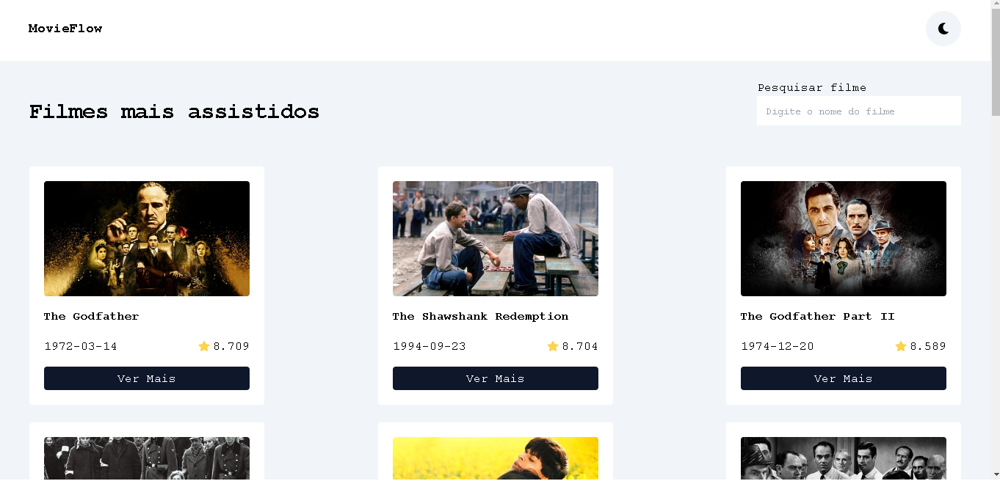

## Preview

 

## 💻Projeto

Meu projeto de filmes oferece uma seleção envolvente na página principal. Explore detalhes fascinantes ao clicar em cada filme, com funcionalidades de mudança de tema para personalização e pesquisa rápida para descobrir seus filmes favoritos

## 🔨Funcionalidades do projeto

- Lista de Filmes: Apresenta uma variedade de filmes na página principal.

- Detalhes do Filme: Ao clicar em um filme, exibe informações detalhadas, avaliações e curiosidades.

- Mudança de Tema: Permite personalizar a aparência do projeto com diferentes temas ou esquemas de cores.

- Pesquisa de Filme: Facilita a busca por filmes específicos.

- Salvar no Navegador: Armazena as preferências do usuário, incluindo o tema escolhido, para uma experiência consistente em visitas futuras.

## 🚀Tecnologias

Esse foi desevolvido com as seguintes tecnologias :

- React JS
- Tailwind CSS

## 🤵Autor

 
Feito por <a href="https://github.com/guilhermeHenrique08">Guilherme Henrique 🚀</a>

## 📝 Licença

Este projeto esta sobe a licença [MIT](./LICENSE).
Feito com ❤️ por Guilherme 👋🏽 [Entre em contato!](https://www.linkedin.com/in/guilherme-marques-68aa16267/)
